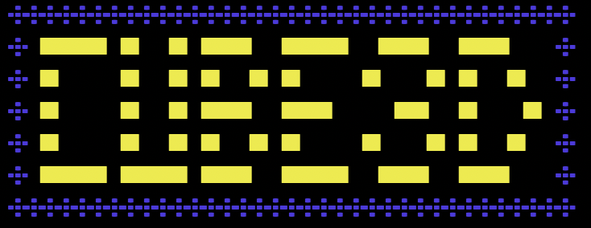
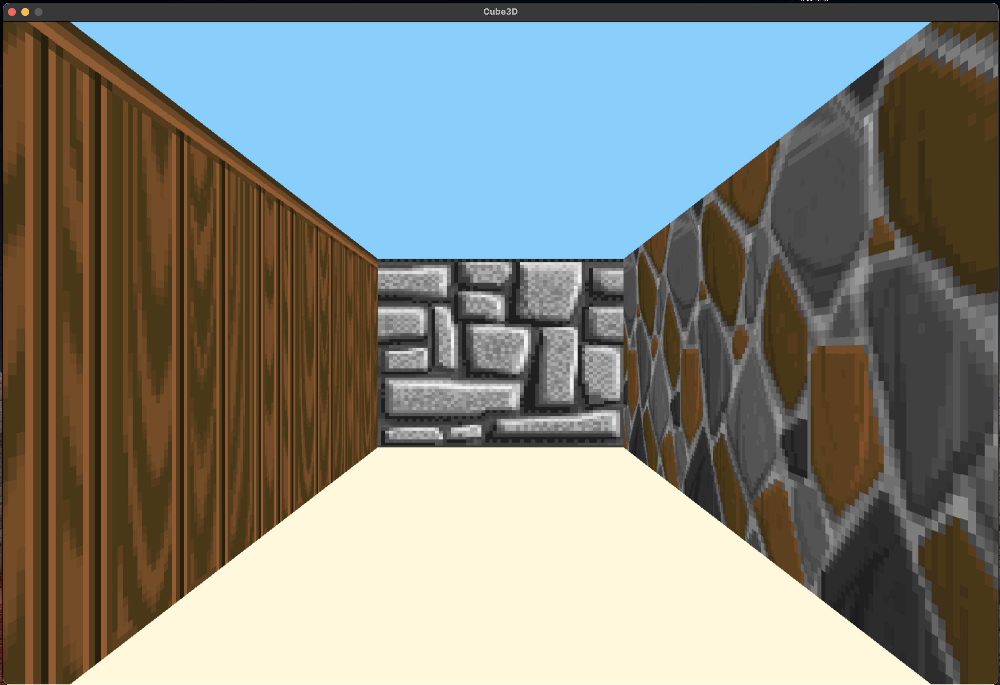
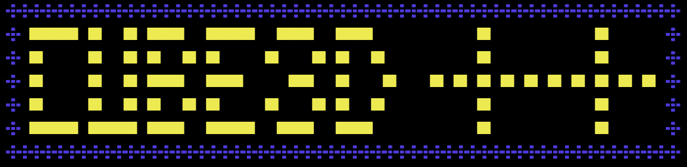
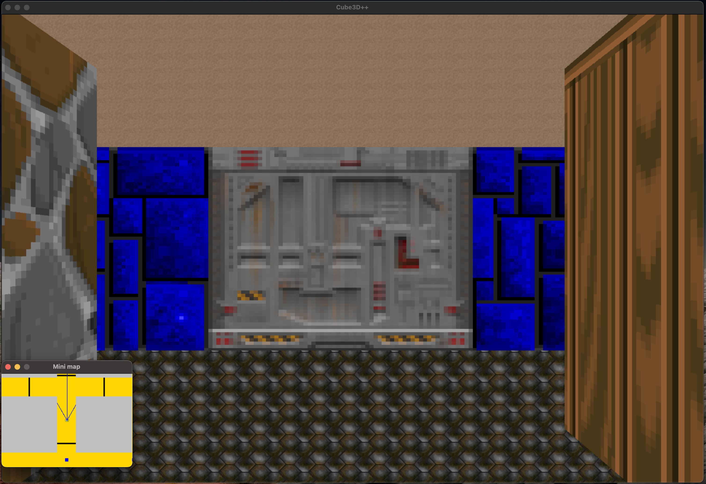

# Cube3D

Cube3D est un projet de l'école 42 qui consiste a creer un jeu en 3D en utilisant la librairie mlx de l'école 42 et l'algorithme de raycasting.

## Table des matières

-[Introduction](#introduction)
-[Mandatory](#mandatory)
-[Installation_Mandatory](#installation)
-[Usage](#usage)
-[Bonus](#bonus)
-[Installation_Bonus](#installation)
-[Auteurs](#auteurs)

## Introduction

## Mandatory

## Installation Mandatory

'''bash
# Clonez le dépôt
git clone git@github.com:Nicostrong/42_Luxembourg_cube_3D.git
'''

## Usage

## Bonus

## Installetion Bonus

## Auteurs

[nicostrong](https://github.com/Nicostrong/)

[phkevin](https://github.com/phoenixnoirdev)